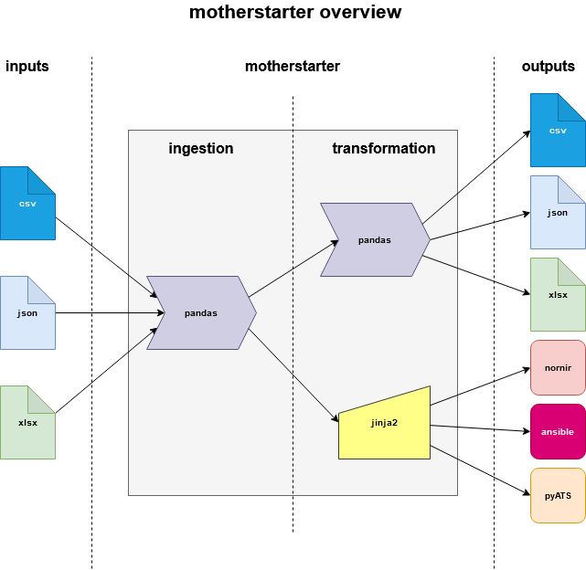

[](https://codecov.io/gh/writememe/motherstarter)

[](https://badge.fury.io/py/motherstarter)
[](https://www.python.org/downloads/release/python-360/)
[](https://www.python.org/downloads/release/python-370/)
[](https://www.python.org/downloads/release/python-380/)
[](https://www.python.org/downloads/release/python-390/)
[](https://github.com/ambv/black)


motherstarter
=======

A network data transformation tool to accelerate the adoption of network automation by providing a command-line interface to convert input file sources to various network automation output formats. An overview diagram is shown below:




# Table of Contents

- [Quick Start Guide](#quick-start-guide)
  - [Installation](#installation)
  - [Basic Usage](#basic-usage)
- [Videos](#videos)
- [Support Matrix](#support-matrix)
- [What is motherstarter?](#what-is-motherstarter)
  - [Why should you use motherstarter?](#why-should-you-use-motherstarter)
  - [Nomenclature](#nomenclature)
    - [Definitions](#definitions)
- [Advanced Usage](#advanced-usage)
  - [Customising Input Data](#customising-input-data)
  - [Customising Templates](#customising-templates)
    - [Still confused?](#still-confused)
- [motherstarter is not...](#motherstarter-is-not-)
- [What is with the name?](#what-is-with-the-name)
- [Release Notes](#release-notes)
- [Contributors](#contributors)


# Quick Start Guide

Install and trial motherstarter in minutes using the guide below:

## Installation

Follow the installation instructions below:

1. Create the virtual environment to run the application in:

```bash
virtualenv --python=`which python3` venv
source venv/bin/activate
```

2. Install the pip package:

```python
pip install motherstarter
```

3. Validate that motherstarter is installed:

```bash
> motherstarter --version
```

## Basic Usage

To use motherstarter, please look at the command-line helper below:

```
(venv) ➜ motherstarter convert --help
Usage: motherstarter convert [OPTIONS]

  Convert source file(s) into network automation inventory outputs based on
  multiple command-line inputs.

  For example:     Input type: json     Output type: nornir

  Args:

      log_level (str): The severity logging level for all events. Valid
      options: "debug", "info", "warning", "error" and "critical".
      source_type (str): The source file type to read the inventory/group
      data from. Valid options: "csv", "json" and "xlsx".

      source_dir (str): The source directory to find the files in.

      template_dir (str): The template directory to find the templates in.

      output_type (str): What file type(s) you would like to be outputted
      as a result of running the function. Valid options: "all", "ansible",
      "csv", "json", "nornir", "pyats" and "xlsx".

  Returns:     N/A

  Raises:     N/A

Options:
  -l, --log-level [debug|info|warning|error|critical]
                                  Specify the logging level.  [default: debug]
  -st, --source-type [csv|json|xlsx]
                                  Specify the source file type.  [default:
                                  json]

  -sd, --source-dir TEXT          Specify the source directory for the source
                                  files.  [default: motherstarter/inputs/]

  -td, --template-dir TEXT        Specify the template directory for the
                                  template files.  [default:
                                  motherstarter/templates/core/]

  -o, --output-type [all|ansible|csv|json|nornir|pyats|xlsx]
                                  Specify the output file types.  This
                                  argument only takes one option.  [default:
                                  all]

  --help                          Show this message and exit.
```

To run using the defaults, execute the following:

```python
motherstarter convert
```
Sample outputs are provided in the [motherstarter/outputs](motherstarter/outputs) folder.

## Videos

Below are some videos which have been made for motherstarter:

### Installation and Getting Started

Watch how to install motherstarter, and how to get started using the basic defaults:

[motherstartarter - Installation and Getting Started](https://youtu.be/7EsrLThgHok)

### Customising input data and templates

Watch how to customise your own input data and templates to suit your own business needs:

[motherstarter - Customise to your environment](https://www.youtube.com/watch?v=4zbgO7JjFiw)

## Support Matrix

The following file formats are supported by motherstarter:

| File format | Description | Input (inventory) | Input (groups)| Output (inventory)| Output (groups) |
| ---------- | ------------ | ----------------- | ------------- | ----------------- | --------------- |
| **csv** |Comma separated file|:heavy_check_mark:|:heavy_check_mark:|:heavy_check_mark:|:heavy_check_mark:|
| **json** |JavaScript Object Notation file|:heavy_check_mark:|:heavy_check_mark:|:heavy_check_mark:|:heavy_check_mark:|
| **xlsx** |Excel workbook |:heavy_check_mark:|:heavy_check_mark:|:heavy_check_mark:|:heavy_check_mark:|
| **ansible** |Ansible configuration files|:x:|:x: |:heavy_check_mark:|:x:|
| **nornir** | Nornir inventory files |:x:|:x: |:heavy_check_mark:|:heavy_check_mark:|
| **pyATS** | pyATS testbed file |:x:|:x: |:heavy_check_mark:|:x:|

## What is motherstarter?

motherstarter was created to bridge the gap between those wanting to use network automation and those who already are with fully formed network automation platforms.

At it's core, motherstarter is designed to address four primary-use cases:

1) Take one input type (json, csv, xlsx) and convert to one or many outputs
2) Provide a facility to promote experimentation with multiple network automation frameworks/solutions
3) Provide a translation layer between "traditional" inventory sources (spreadsheets) and more modern inventory
sources
4) Provide extensibility to leverage custom data to enrich metadata about your inventory

### Why should you use motherstarter?

motherstarter is of value to those who are:
- Looking to "seed" new network automation platforms. For example, use nornir/napalm to get facts about a network and then populate a system such as netbox.
- Looking to trial and experiment different automation frameworks. For example, you want to try pyATS for a certain feature, or use Ansible modules because they solve a specific use-case for fact gathering.
- Who move between multiple environments and need reliable inventory sources for automation solutions. For example, you are a consultant who has to perform network audits or perform repetitive work between multiple customers.
- Need an interim inventory offering, prior to migrating to a more robust solution.

### Nomenclature

Throughout the tool and subsequent code, it's important to establish some terminology which is used.   Unsuprisingly, each automation solution uses slightly different names for the same thing. A reference table
is supplied below:

#### Definitions

| motherstarter | nornir | ansible | pyats |
| -------------- | ----- | ------- | ----- |
| inventory |hosts|hosts|devices|
|groups |groups|groups|Not applicable|
| Not applicable |defaults|all|Not applicable|

motherstarter will make frequent usage of `inventory` and `groups` throughout the code and templates, so this table is a handy reference when trying to understand the differences.

## Advanced Usage

motherstarter provides the ability to provide your own input data, using the `--source-dir` option at the command-line. In addition to this, motherstarter also allows you to provide your own templates using the `--template-dir` at the command-line. The instructions are provided below:

### Customising Input Data

As mentioned in the [Support Matrix](#support-matrix), motherstarter provided three input types; csv, json and xlsx files.

The files must follow the naming conventions as supplied in the [sample inputs folder](https://github.com/writememe/motherstarter/tree/master/motherstarter/inputs). This includes the name(s) of the files and the name of spreadsheet tabs in the xlsx files. You can name the source directory folder in whatever name you like, as long as it contains the applicable files. Two valid examples are shown below:

```bash
inputs/ <----- This would be the source-dir folder at the command line, using xlsx as the source-type
├── groups.xlsx
└── inventory.xlsx
```

```bash
environments/
└── prod/ <----- This would be the source-dir folder at the command line, using json as the source-type
    ├── groups.json
    └── inventory.json
```

### Customising Templates

motherstarter provides a framework for you to write your own templates for ansible, nornir and pyATS files. The file and folder must follow the naming conventions as supplied in the [sample templates folder](https://github.com/writememe/motherstarter/tree/master/motherstarter/templates). This includes the name(s) of the Jinja2 templates and the name of the folders. You can name the template directory folder in whatever name you like, as long as it contains the applicable files and folders. Two valid examples are shown below:

```
templates
├── custom <----- This would be the template-dir folder at the command line
│   ├── ansible
│   │   └── hosts.j2
│   ├── nornir
│   │   ├── groups.j2
│   │   └── hosts.j2
│   └── pyats
│       └── testbed.j2
└── standard <----- This would be the template-dir folder at the command line
    ├── ansible
    │   └── hosts.j2
    ├── nornir
    │   ├── groups.j2
    │   └── hosts.j2
    └── pyats
        └── testbed.j2
```

**NOTE: All inventory templates leverage a dictionary called `inventory`, and all group templates leverage a template called `groups`. When customising your templates, ensure that you iterate over the correct dictionary. Please follow the sample templates which have been supplied**

### Still confused?

A video showing both customising the input data and templated data is provided [here](https://youtu.be/4zbgO7JjFiw)

## motherstarter is not ...

It's important to understand that motherstarter does not intend, nor plan to be a permanent, enterprise-class inventory solution. motherstarter cannot substitute for a first-class system such as netbox. It's anticipated that you will reach the limits of motherstarter as an inventory solution, if you plan to make the inventory files available in multiple locations over multiple solutions.

You may temporarily get around this by saving the outputs to Git and using version control to track changes. But, again a proper, permanent solution should be considered beyond that.


## What is with the name?

__**Do you appreciate a good sourdough?**__

As part of the process, bakers will nuture a 'starter' (or mother starter) consisting of flour, water and wild yeast. Each day they take some of the starter to make loaves and the rest is fed with fresh water and flour. Over time, the 'motherstarter' increases in complexity and makes even tastier sourdough bread. From basic, freely available ingredents, a very tasty bread is made.

motherstarter is a take on this concept.

You feed the tool good "data", and you can take it's output to make great solutions. Over time, you feed it even more data and as a result, you can solve more complex and interesting problems on more devices.
 
## Release Notes

Please see the [CHANGELOG](./CHANGELOG.md) for release notes.

## Contributors

A very big thank you to the [CONTRIBUTORS](./CONTRIBUTORS.md) on this project.
